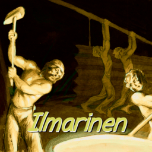

# Uusi Aurinko

*Uusi Aurinko* means New Sun in Finnish. Through a series of chaotic and destructive operations,
the players can blow up the world with a glorious(or dark) new sun.

This mod is made by team Ilmarinen, which takes part in the 2021 TeaCon development competition.

## Documents
Mod Design Document V1.0 (Chinese): [ModDesign.pdf](https://github.com/LucunJi/uusi-aurinko/blob/master/documents/ModDesign.pdf)

Devlog and other articles (Chinese): [UusiAurinko](https://lucunji.github.io/tags/UusiAurinko/)

## Terms of use
This mod is published under [GPL-3.0 license](./LICENSE).

The sound effects
"[electricity_1.ogg](./src/main/resources/assets/uusi-aurinko/sounds/electricity_1.ogg)" and
"[electricity_2.ogg](./src/main/resources/assets/uusi-aurinko/sounds/electricity_1.ogg)"
are derivatives of 
"[Shock Sound Effect](https://www.freesoundslibrary.com/shock-sound-effect/)"
by spanac, used under [CC BY 4.0](https://creativecommons.org/licenses/by/4.0/).
"electricity_1.ogg" and "electricity_2.ogg" are licensed under [CC BY 4.0](https://creativecommons.org/licenses/by/4.0/) by 
[LucunJi](https://github.com/LucunJi).
